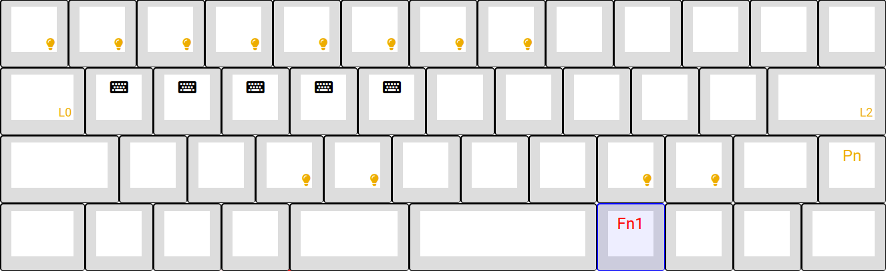

# Keyboard configuration

Keyboard configuration for the Vortex Core 40% keyboard.

Generated using [TsFreddie's MPC tool](https://tsdo.in/much-programming-core/).

## Layer 0

Macros are mainly used for shift, ctrl & alt modifiers.

## Layer 1

Lighting configuration layer with some macros for workspaces.

